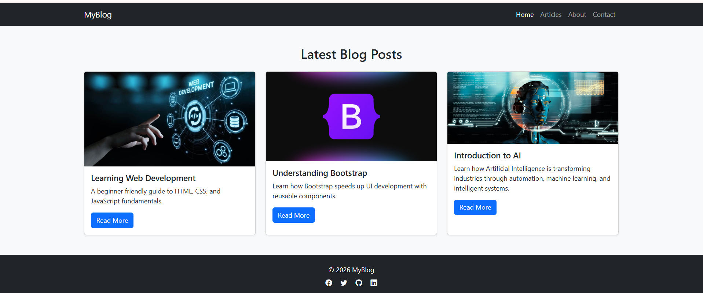
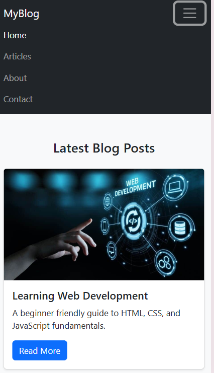

# Bootstrap Blog Layout Project

##  Project Overview

This project is a **responsive blog page** built using **Bootstrap 5 CDN**. It demonstrates the use of Bootstrap components such as **Navbar, Cards, Grid System, and Footer** to create a clean and modern UI.

## 📸 Screenshots

### 💻 Desktop View

### 📱 Mobile View

##  Features

* Responsive layout (mobile, tablet, desktop)
* Navigation bar with menu links
* Blog post cards with image, title, and description
* “Read More” buttons for interaction
* Footer with social media icons
* Clean spacing using Bootstrap utility classes

##  Technologies Used

* HTML5
* Bootstrap 5 (CDN)
* Bootstrap Icons
* CSS (optional custom styling)

## ⚙️ Setup Instructions

1. Download or clone the project
2. Open `index.html` in any browser
3. Ensure internet connection (for Bootstrap CDN)

## 📱 Responsiveness

* Uses Bootstrap grid system (`col-md-4`)
* Automatically adapts layout:

  * Mobile → 1 column
  * Tablet → 2 columns
  * Desktop → 3 columns

